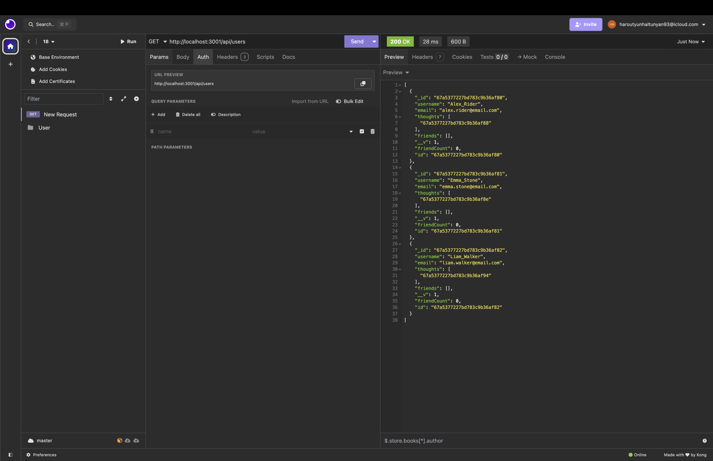
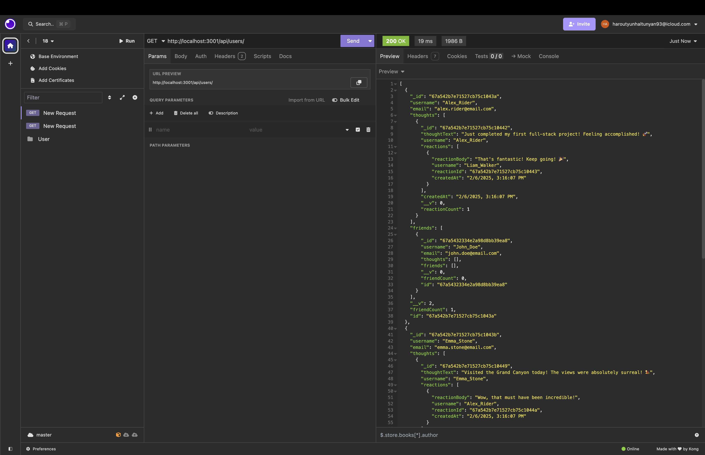
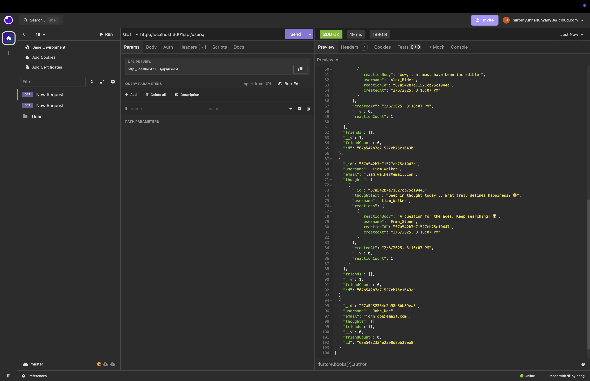
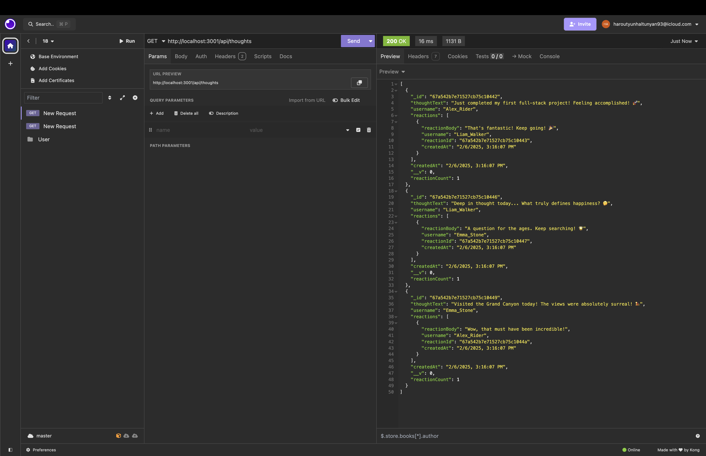
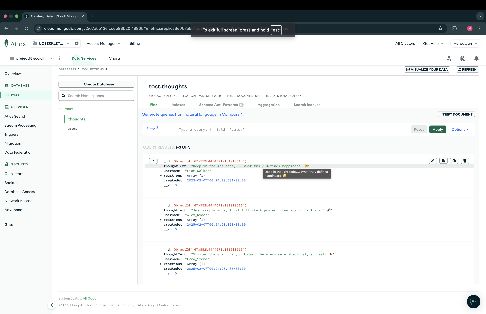
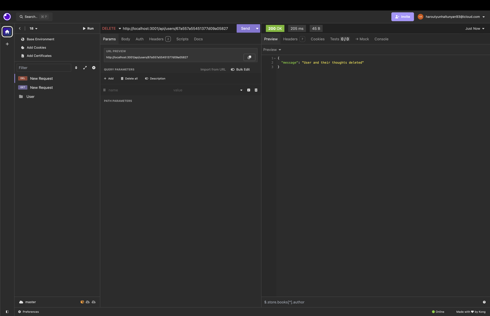
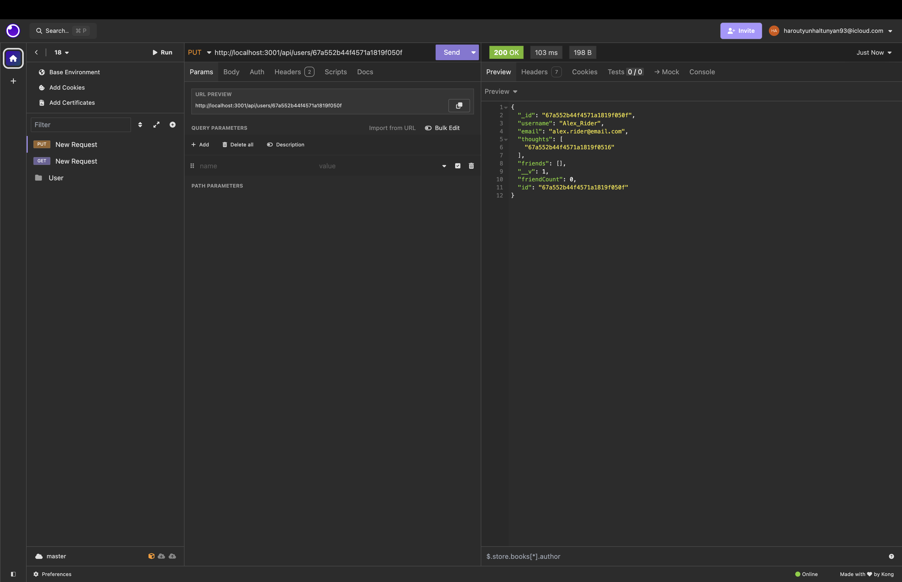
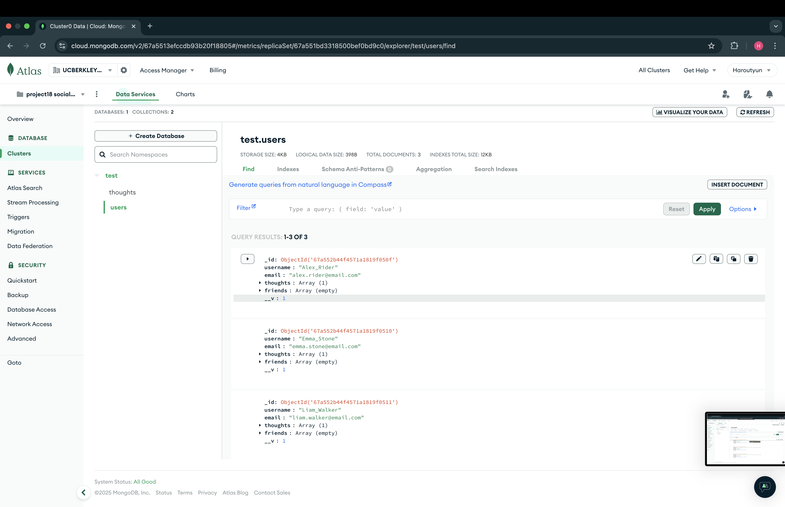

# **📌 Social Network API**

## **🚀 Description**
This is a **NoSQL-based API** for a social network web application where users can share their thoughts, react to friends' thoughts, and manage their friend list. The backend is built using **Node.js, Express, and MongoDB (Mongoose ODM)**.

https://drive.google.com/file/d/1umZNqH0R3PyEE7vlZtIgeNW_KSNvtBqj/view


---

## **📖 Table of Contents**
- [📌 Social Network API](#-social-network-api)
- [🚀 Description](#-description)
- [🛠️ Technologies Used](#️-technologies-used)
- [📂 Folder Structure](#-folder-structure)
- [🚀 Installation & Usage](#-installation--usage)
- [📡 API Routes](#-api-routes)
  - [📌 User Routes](#-user-routes)
  - [💭 Thought Routes](#-thought-routes)
  - [💬 Reaction Routes](#-reaction-routes)
  - [👥 Friend Routes](#-friend-routes)
- [📌 Example JSON Responses](#-example-json-responses)
- [📝 License](#-license)

---

## **🛠️ Technologies Used**
- **Node.js** - Backend runtime
- **Express.js** - API routing framework
- **MongoDB** - NoSQL database
- **Mongoose** - MongoDB ODM
- **dotenv** - Environment variable management
- **nodemon** - Auto-restart development server

---

## **📂 Folder Structure**
📦 Social_Network_API
┣ 📂 config
┃ ┗ 📜 connection.js        # MongoDB connection setup
┣ 📂 models
┃ ┣ 📜 Thought.js           # Thought schema
┃ ┣ 📜 User.js              # User schema
┣ 📂 routes
┃ ┣ 📂 api
┃ ┃ ┣ 📜 userRoutes.js      # User routes
┃ ┃ ┣ 📜 thoughtRoutes.js   # Thought routes
┃ ┃ ┗ 📜 index.js           # API routes index
┃ ┗ 📜 index.js             # Main route handler
┣ 📂 utils
┃ ┗ 📜 seed.js              # Script to seed database with sample data
┣ 📜 .gitignore
┣ 📜 package.json
┣ 📜 README.md              # You’re reading this file
┣ 📜 server.js              # Main entry point

---

## **🚀 Installation & Usage**
### **🔧 Prerequisites**
Ensure you have **Node.js** and **MongoDB** installed.

### **1️⃣ Clone the Repository**
```bash
git clone https://github.com/yourusername/social-network-api.git
cd social-network-api

2️⃣ Install Dependencies
npm install

3️⃣ Setup Environment Variables
Create a .env file in the root directory:
MONGO_URI=mongodb://127.0.0.1:27017/socialNetworkDB
PORT=3001

4️⃣ Seed the Database (Optional)
If you want sample users and thoughts:
node utils/seed.js

5️⃣ Start the Server
npm start

📡 API Routes
📌 User Routes
Method	Endpoint	Description
GET	/api/users	Get all users
GET	/api/users/:id	Get a single user by ID
POST	/api/users	Create a new user
PUT	/api/users/:id	Update a user by ID
DELETE	/api/users/:id	Delete a user and their thoughts

💭 Thought Routes
Method	Endpoint	Description
GET	/api/thoughts	Get all thoughts
GET	/api/thoughts/:id	Get a single thought by ID
POST	/api/thoughts	Create a new thought
PUT	/api/thoughts/:id	Update a thought by ID
DELETE	/api/thoughts/:id	Delete a thought

💬 Reaction Routes
Method	Endpoint	Description
POST	/api/thoughts/:thoughtId/reactions	Add a reaction to a thought
DELETE	/api/thoughts/:thoughtId/reactions/:reactionId	Remove a reaction

👥 Friend Routes
Method	Endpoint	Description
POST	/api/users/:userId/friends/:friendId	Add a friend to a user’s friend list
DELETE	/api/users/:userId/friends/:friendId	Remove a friend from the 

📌 Example JSON Responses

✅ Create a User

POST /api/users
{
  "username": "John_Doe",
  "email": "john.doe@email.com"
}

Response
{
  "_id": "67a5432334e2a98d8bb39ea8",
  "username": "John_Doe",
  "email": "john.doe@email.com",
  "thoughts": [],
  "friends": [],
  "__v": 0
}

💭 Get All Thoughts
GET /api/thoughts
[
  {
    "_id": "67a542b7e71527cb75c10442",
    "thoughtText": "Just completed my first full-stack project! Feeling accomplished! 🚀",
    "username": "Alex_Rider",
    "reactions": [
      {
        "reactionBody": "That's fantastic! Keep going! 🎉",
        "username": "Liam_Walker",
        "reactionId": "67a542b7e71527cb75c10443",
        "createdAt": "2/6/2025, 3:16:07 PM"
      }
    ],
    "createdAt": "2/6/2025, 3:16:07 PM",
    "__v": 0,
    "reactionCount": 1
  }
]

💬 Add a Reaction to a Thought
POST /api/thoughts/67a542b7e71527cb75c10442/reactions
{
  "reactionBody": "This is amazing!",
  "username": "John_Doe"
}

👥 Add a Friend
POST /api/users/67a542b7e71527cb75c1043a/friends/67a5432334e2a98d8bb39ea8
Response:
{
  "user": {
    "_id": "67a542b7e71527cb75c1043a",
    "username": "Alex_Rider",
    "friends": [
      {
        "_id": "67a5432334e2a98d8bb39ea8",
        "username": "John_Doe"
      }
    ]
  },
  "newFriend": {
    "username": "John_Doe",
    "friendId": "67a5432334e2a98d8bb39ea8"
  }
}

📝 License
This project is licensed under the MIT License.

🚀 Author
Developed by Harout Altunyan
🎯 Bootcamp Project | February 2025

📌 Notes
	•	This project is designed as a backend API only.
	•	You can test routes using Insomnia or Postman.
	•	Future plans: Implement frontend integration.

  
  
  
  
  
  
  
  
  
  
  